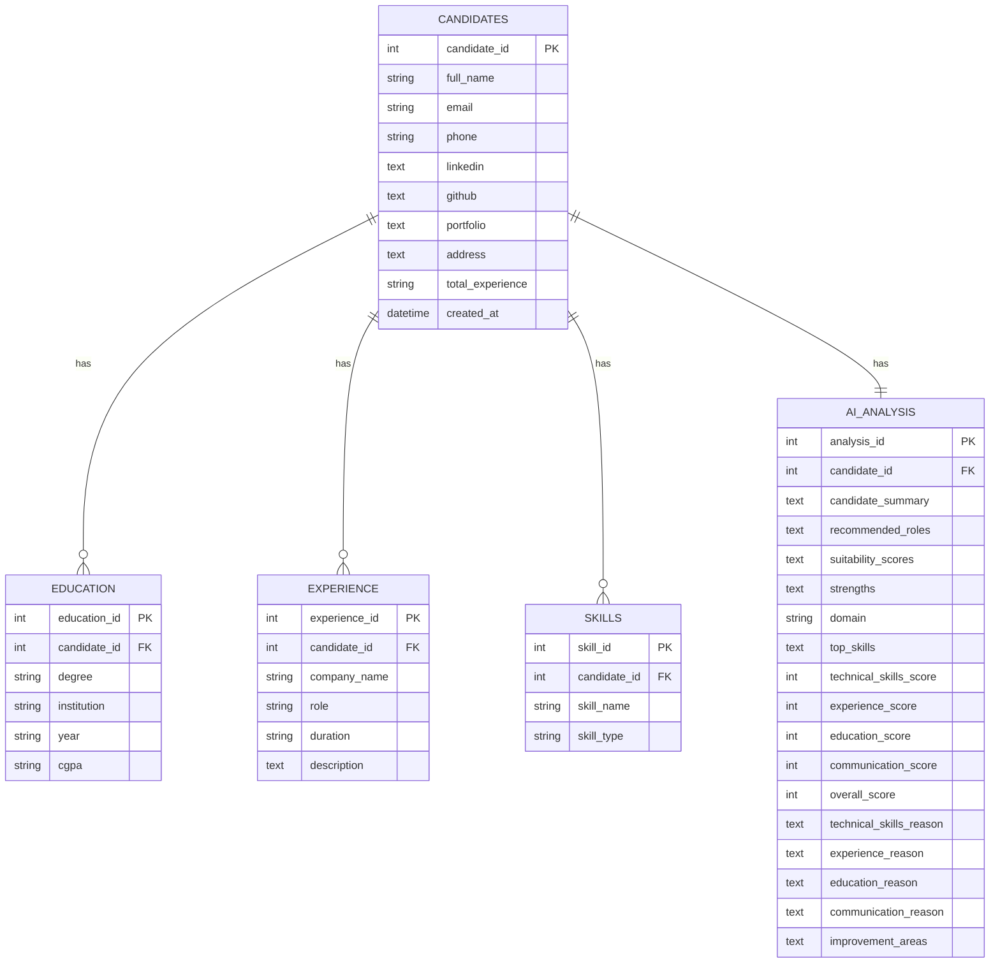

# RecruitFlow ER Diagram

This ER diagram reflects the current SQLAlchemy models in `app/database/models.py`.

```mermaid
erDiagram
    CANDIDATES {
        int candidate_id PK
        string full_name
        string email
        string phone
        text linkedin
        text github
        text portfolio
        text address
        string total_experience
        datetime created_at
    }

    EDUCATION {
        int education_id PK
        int candidate_id FK
        string degree
        string institution
        string year
        string cgpa
    }

    EXPERIENCE {
        int experience_id PK
        int candidate_id FK
        string company_name
        string role
        string duration
        text description
    }

    SKILLS {
        int skill_id PK
        int candidate_id FK
        string skill_name
        string skill_type
    }

    AI_ANALYSIS {
        int analysis_id PK
        int candidate_id FK
        text candidate_summary
        text recommended_roles
        text suitability_scores
        text strengths
        string domain
        text top_skills
        int technical_skills_score
        int experience_score
        int education_score
        int communication_score
        int overall_score
        text technical_skills_reason
        text experience_reason
        text education_reason
        text communication_reason
        text improvement_areas
    }

    CANDIDATES ||--o{ EDUCATION : has
    CANDIDATES ||--o{ EXPERIENCE : has
    CANDIDATES ||--o{ SKILLS : has
    CANDIDATES ||--|| AI_ANALYSIS : has
```
